# my torn scripts

To use these scripts, install a userscript manager extension in your browser:
* [Tampermonkey](https://www.tampermonkey.net/) (Recommended)
* [Violentmonkey](https://violentmonkey.github.io/)

#

| Category | Script Name | Description | Last Updated | Preview | Quick Install |
| :--- | :--- | :--- | :---: | :---: | :---: |
| **Attacking** | Astral Guard Warning | Shows a warning if the Astral Guard effect is active (minion/maol invulnerability). | 11 Apr 2026 | 

Preview

 |  |
| **Attacking** | Attack Bind | Press `ALT+A` on a player's profile to navigate directly to their attack page. | 01 Sep 2026 | 

Preview

 |  |
| **Attacking** | Halloween Target List | Adds toggle to profiles and displays the list under Enemies and Targets. | 27 Sep 2026 | 

Preview
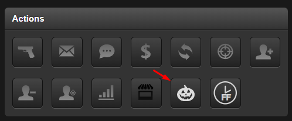
 |  |
| **Attacking** | Log Highlighter | Highlights special events inside attack logs. | 21 Jul 2026 | 

Preview
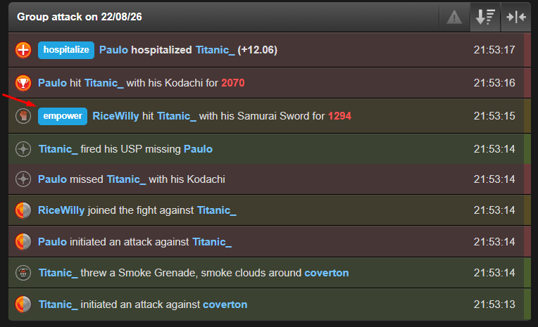
 |  |
| **Attacking** | Zerg Defyer | Makes usernames on the attack loader clickable directly to their attack pages. | 10 Apr 2026 | 

Preview

 |  |
| **Bazaar** | Auto-Fill Search | Auto-fills search field with item name in bazaars. | 10 Feb 2025 | 

Preview
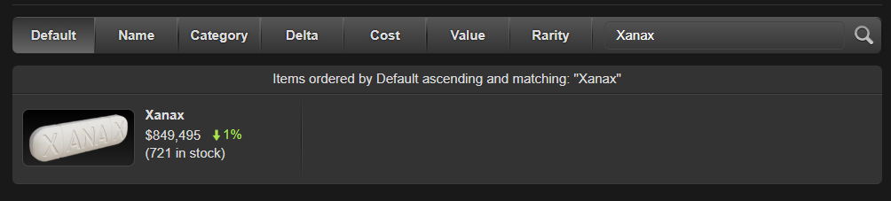
 |  |
| **Bazaar** | Remove All | Adds a convenient remove all button to the bazaar management page. | 10 Feb 2025 | 

Preview
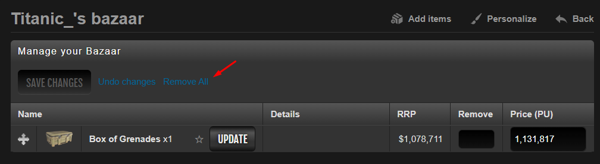
 |  |
| **Company** | Max Deposit | Automatically maxes out the deposit input in a company vault. | 22 May 2025 | 

Preview

 |  |
| **Company** | Withdraw Buttons | Adds buttons to remove at million $ intervals to make managing money easier. | 22 May 2025 | 

Preview
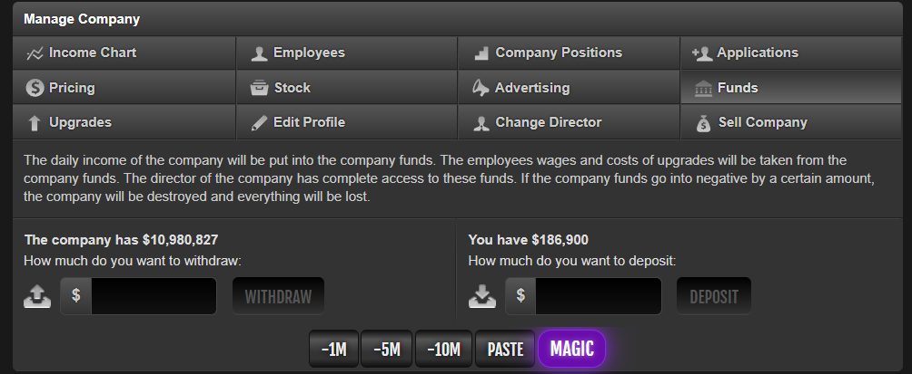
 |  |
| **Crimes** | Pickpocket Helper | Pickpocket HUD overlay for Crimes 2.0. | 22 Sep 2026 | 

Preview
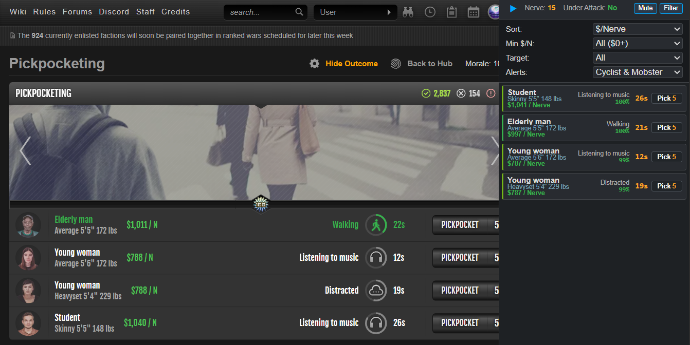
 |  |
| **Display Case** | Buttons | Adds buttons to instantly move to top or bottom of display case lists. | 10 Feb 2025 | 

Preview
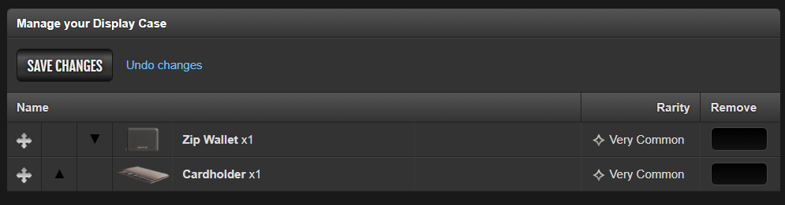
 |  |
| **Display Case** | Checklist | Adds a button that shows all items you have and don't have. | 03 Nov 2025 | 

Preview
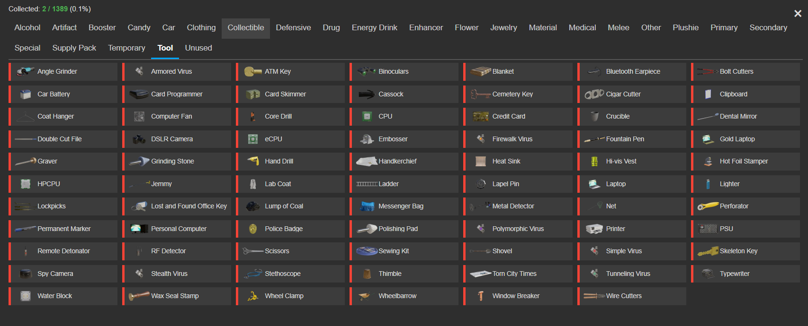
 |  |
| **Global** | Education Timer | Converts remaining education timer to hours. | 28 Dec 2024 | 

Preview

 |  |
| **Global** | Mini Calendar | Adds a mini calendar to the Torn header. | 02 Sep 2026 | 

Preview
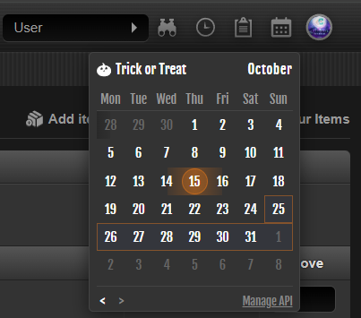
 |  |
| **Global** | Profit Checker | Adds a button in sidebar to find profitable items in tornw3b. | 17 Oct 2025 | 

Preview

 |  |
| **Hospital** | One Click Revive | Makes revives a single click action. | 04 Nov 2024 | 

Preview

 |  |
| **Hospital** | Remove Revives Below X% | Removes revive options below a designated percentage threshold. | 13 Feb 2025 | 

Preview

 |  |
| **Property** | Renamer | Adds a pencil icon next to properties to edit nicknames. | 08 Dec 2024 | 

Preview
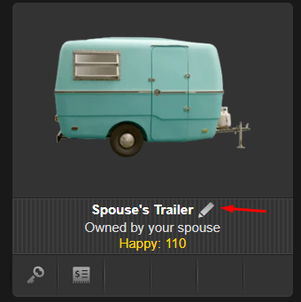
 |  |
| **Search** | Riggers and Minors | Highlights oil riggers on Torn advanced search page. | 31 Oct 2024 | 

Preview
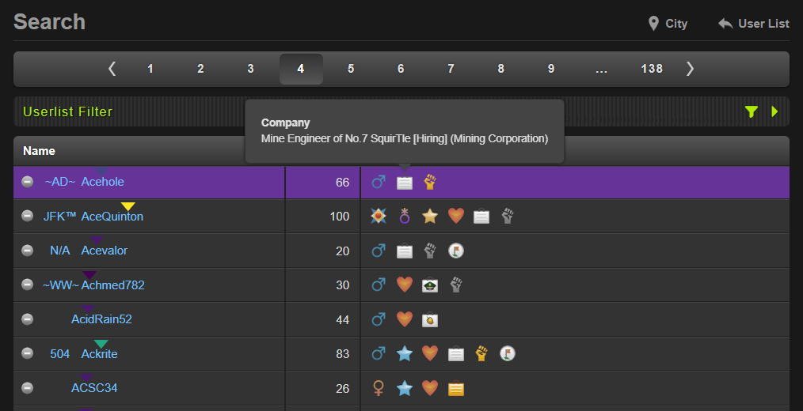
 |  |
| **Trading** | Ghost Trade Buttons | Adds million-dollar interval buttons on trade page to manage money easily. | 20 May 2025 | 

Preview
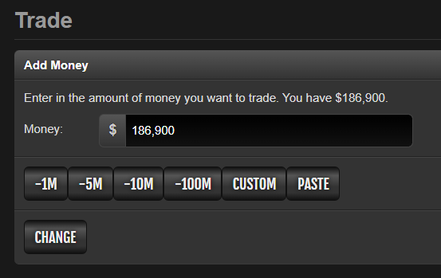
 |  |
| **Trolling** | Give to Hollis | Quick send item shortcut for Hollis. | 17 Jul 2025 | 

Preview

 |  |
| **Users** | Background Check | Adds Quick Lookup and Discord buttons to profiles with integrated Federal Jail records. | 22 Sep 2026 | 

Preview
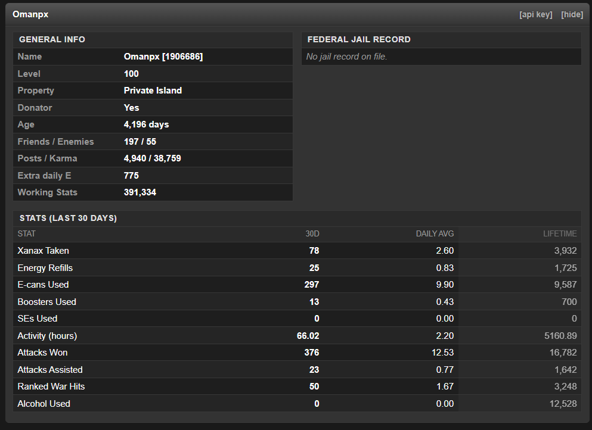
 |  |
| **Warring** | Member Status | Displays online, offline, and idle counts during faction wars. | 11 Mar 2026 | 

Preview

 |  |
| **Warring** | Stakeout | Stakeout factions or individual users. | 06 Jul 2026 | 

Preview
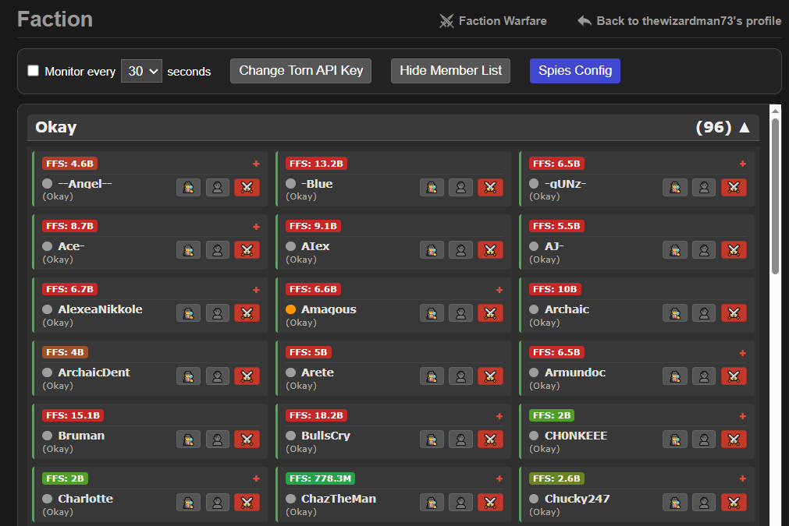
 |  |
| **Warring** | Stop hitting midknight | Removes attack buttons for specified user IDs. | 03 Feb 2025 | 

Preview

 |  |
